# Lora IoT Irrigation System

```c++
/*
Version:		V3.0
Author:			Vincent
Create Date:	2020/7/15
Note:
2020/7/20 	V1.1:Optimized the web page and modified the name of the sensor.Without change the picture.
2020/12/3 	V2.0:A new version with a standby current of only 672ua has been added.And upload ThingSpeak.
2021/11/20	V3.0:Delete useless code, supply Lora Soil Moisture V3.
*/
```
[YOUTUBE:Lora IoT Irrigation System - Outdoor Simulation Test](https://youtu.be/0mY6Ox0YvRk)


[toc]

# OVERVIEW

## Intruduce

[Makerfabs home page](https://www.makerfabs.com/)

[Makerfabs Wiki](https://makerfabs.com/wiki/index.php?title=Main_Page)

Using ESP32 as a gateway, three soil sensors and a relay were controlled to form a simple Iot agriculture greenhouse simulation project.Ambient weather data, soil moisture data and relay status can be accessed via LCD screen and web page.And through a simple web page or code to control the timing of the relay switch and read data.


## Equipment list

- [MakePython ESP32](https://www.makerfabs.com/wiki/index.php?title=MakePython_ESP32)
- [MakaPython Lora](https://www.makerfabs.com/wiki/index.php?title=MakaPython_Lora)
-  [Lora Relay](https://www.makerfabs.com/wiki/index.php?title=Lora_Relay)
-  [Lora Soil Moisture Sensor](https://www.makerfabs.com/wiki/index.php？title=Lora_Soil_Moisture_Sensor)
-  CP2104 USB2UART Module

# DOWNLOAD CODE

## MicroPython Lora
- Plug the ESP32 and Lora extension boards together.


- Connect MakePython ESP32 to your PC, open uPyCraft, and select connect to the serial port.

- Firmware will be prompted if it has not been burned before or for other reasons.Board selects ESP32, BURN_addr selects 0x1000, Erase_Flash selects Yes, com selects the port number.Firmware Choose Users, click Choose to Choose ESP32-IDF3-20190125-v1.10.bin in the folder.


- Download all python programs ending in.py from the "\Project_IoT-Irrigation-System\iot_makepython\workSpace" to ESP32.

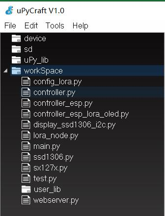

- Set test.py to default run. (Go to the program on ESP32 in the Device folder and right-click to set it to start by default.)

- Press the RST button on ESP32 to reset the development board. The LCD screen will display some default data.

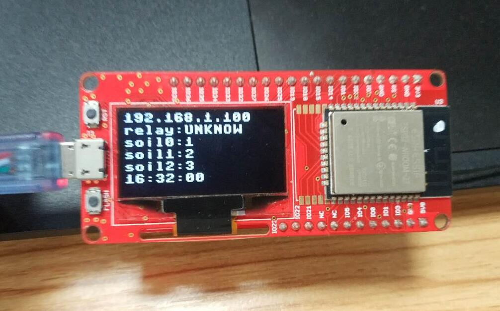


## Burn Sensor
- Open arduino ide.
- Open file "\Project_IoT-Irrigation-System\iot_moisture_V3\iot_moisture_V3.ino"
- Select Tools/Manage Libraries.
- Install RadioLib by Jan Gromes.

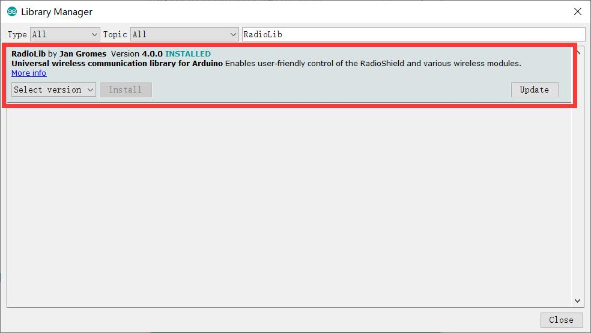

- If youer ardino ide version is old,maybe can't auto install dependent libraries. You may manual install or upgrade arduino ide, such as 1.8.13.
- Change NODECODE to either Soil1, Soil2, or Soil3.

```c++
#define NODENAME "Soil1"
```

- After saving, select "Tools", select "Development Board" Arduino Pro or Pro min, select processor ATmega328p 3.3V 8MHz, and select corresponding serial port.


- Connect the sensor and PC through "CP2104 USB2UART Module"。

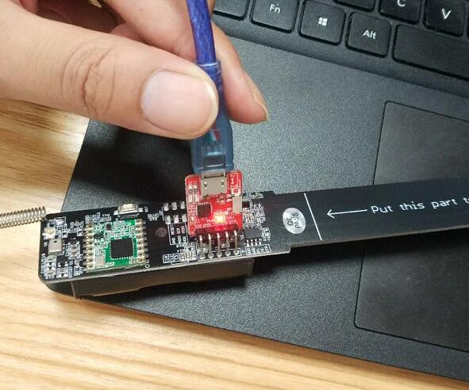

- Push Upload.


## Burn Relay

- Open file "\Project_IoT-Irrigation-System\iot_relay\iot_relay.ino"
- Connect relay and PC through "CP2104 USB2UART Module"。

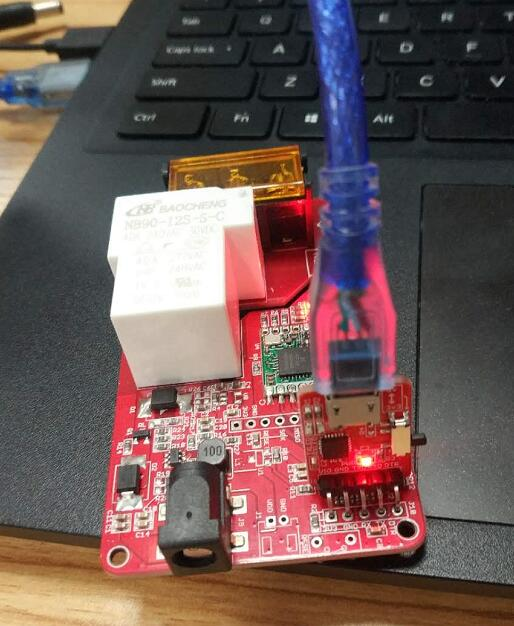

- Choice relay port.
- Push Upload.

# TRY TO USE

## Web Control

- Restart ESP32 and wait for the LCD screen to refresh and show the latest round of sensor data.

- Enter the IP shown in the first row of the ESP32 LED screen in the browser address bar.


- The page will display a table and four buttons.

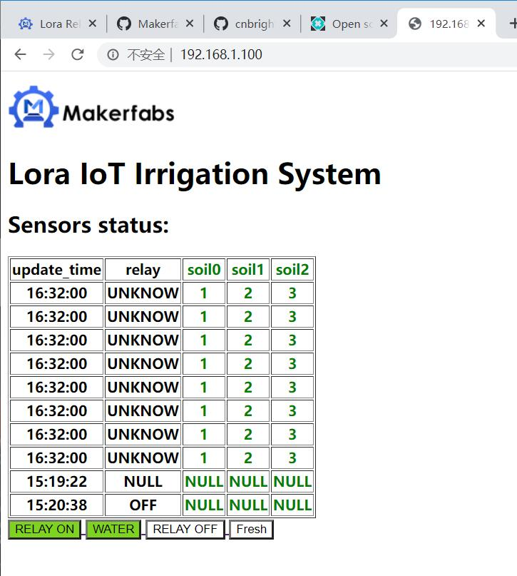

- The table contains historical data stored internally at ESP32, including time, relay status, and sensor status.

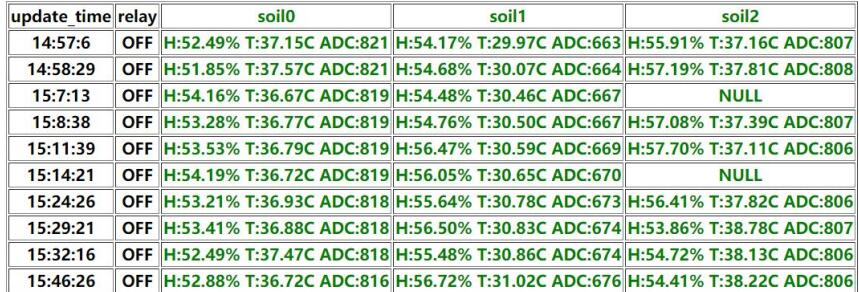

- Four buttons: Relay on, Water, Relay off, fresh.
	- Relay on : Turn on relay.
	- Water: Relay on for ten seconds.
	- Relay off : Turn off relay.
	- Fresh: Get the latest data.

- All but the Fresh button can trigger the sensor sampling.Fresh will only be used for the latest ESP32 data and will not affect the system's own passive measurement cycle.

- Once the system is determined to be in order, the sensors can be plugged into different locations for data sampling.

## Outdoor Test

- Place in the parking lot flower bed at four downstairs.

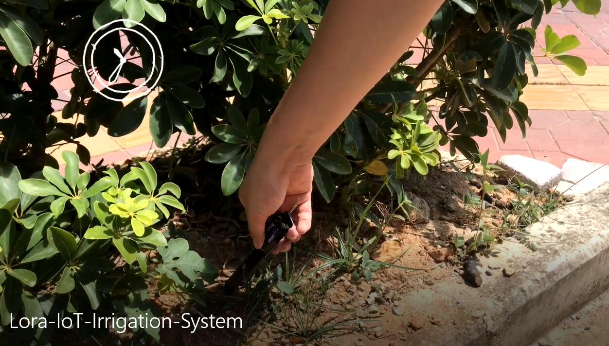

- Put it on the lawn about a hundred meters away.

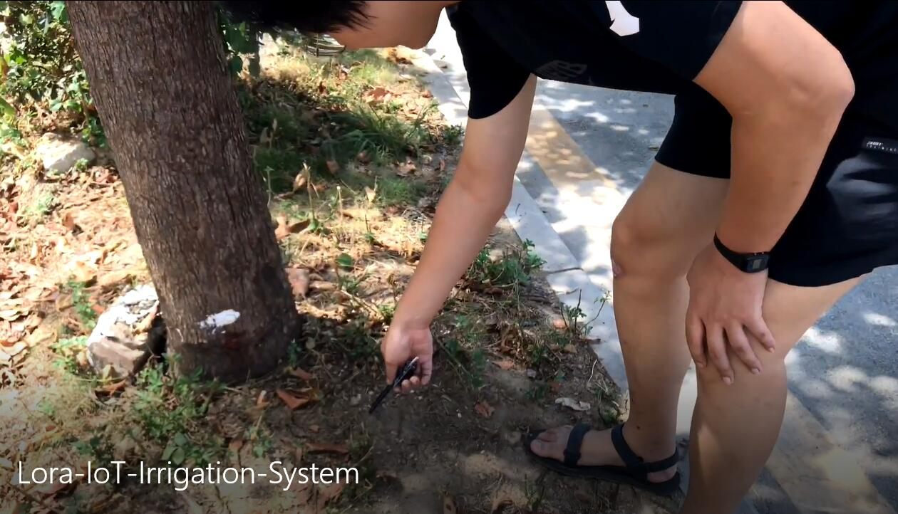

## The data analysis

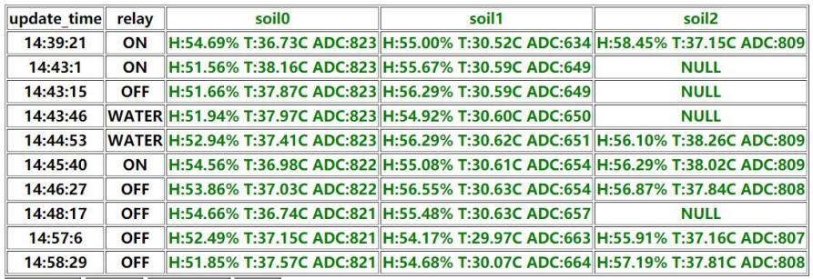

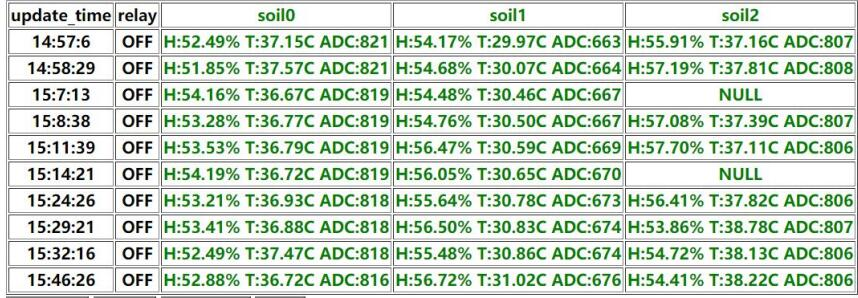

- Soil1 is placed in the flower pot in the office, Soil2 is placed in the parking lot below the company, and Soil0 is placed in the grass on the road about 100 meters away from the company.
- Sometimes Soil2 messages are not received due to traffic or wall obstruction.
- H is the air humidity, T is the air temperature, ADC is the soil humidity value, the greater the value, the drier.
- It can be seen that the indoor temperature of Soil1 is 30 degrees Celsius, and the pot is moist with water.
- Soil0 is placed in the roadside flower bed, although it is dry, but in the shade of the tree, the temperature is slightly lower.
- Soil2 parking lot, slightly hotter than Soil0.Both soils are very dry.

# CODE EXPLAIN

## ESP32

### controller.py


- The Controller class is the parent class that abstracts the basic pin content of the Lora module.
- Add_transceiver () adds an SX127X chip object as the send chip, because the MakePython Lora can carry two SX127X chips.
- The remaining functions are some of the early test functions, or hardware pin preparation functions, of no concern to this experiment.

### controller_esp.py

- Machine module of MicroPyton is referenced to prepare SPI and GPIO initialization.
- The Controller_esp.Controller class inherits from controller.Controller.
- The model and SPI pins of the hardware for ESP were determined.
- The rest of the overloaded member functions are initialized by hardware pins such as SPI.

### controller_esp_lora_oled.py

- controller_esp_lora_oled.Controller class inherits from the  controller_esp.Controller。
- The Controller_ESP_lora_OLd.Controller class inherits from the Controller_esp.Controller.

### ssd1306.py

- Ssd1306 led screen driver.

### display_ssd1306_i2c.py

- Ssd1306 LED screen based on I2C basic display library.
- Text display function.
- Image display function.

### sx127x.py

- Lora module driver function.
- Includes basic Lora module Settings such as frequency, lead code, calibration, spread spectrum factor, etc.

### config_lora.py

- To accommodate some configuration code for multiple platforms.

### lora_node.py

- Lora Gateway object.
- Encapsulated send method and receive interrupt and other functional functions.

### webserver.py

- Connect the wifi.
- Provide control pages.

## Lora Relay

### Lora_relay_new.ino

- Relay control program, including LORA driver (RadioLib library), relay switch control.

## Lora Soil Moisture Sensor

### LoraTransmitterADCAHT10.ino

- Soil moisture sensor control program, including LORA Drive (RadioLib Library), soil moisture detection.

### I2C_AHT10.h

- AHT10 air temperature and humidity sensor header file.

### I2C_AHT10.cpp

- AHT10 air temperature and humidity sensor driver.
