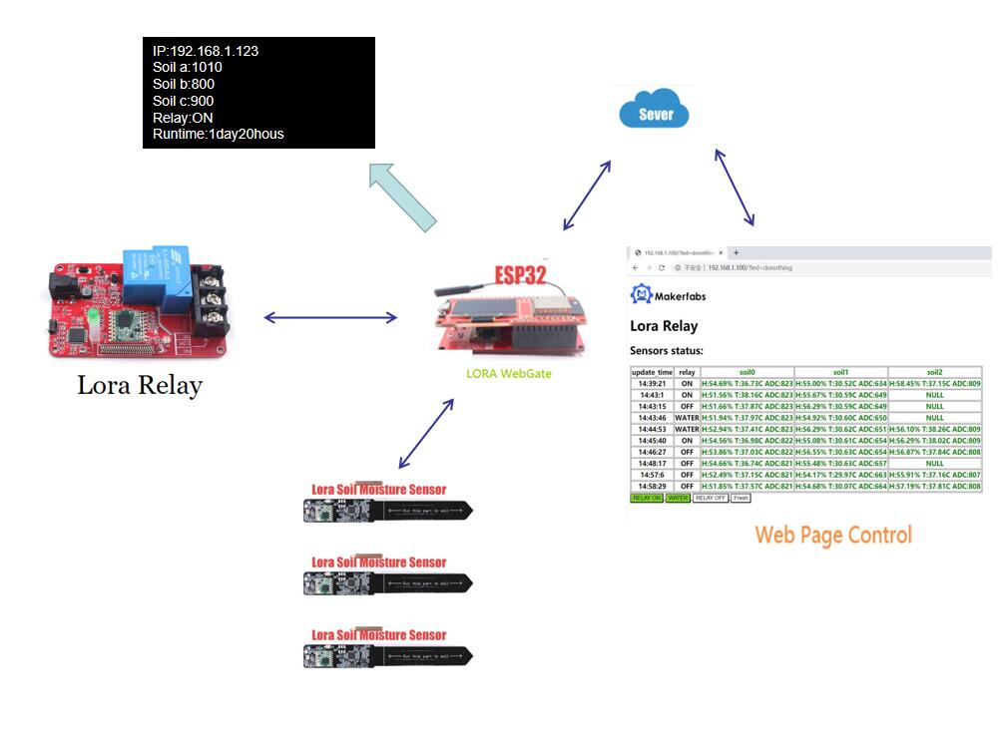
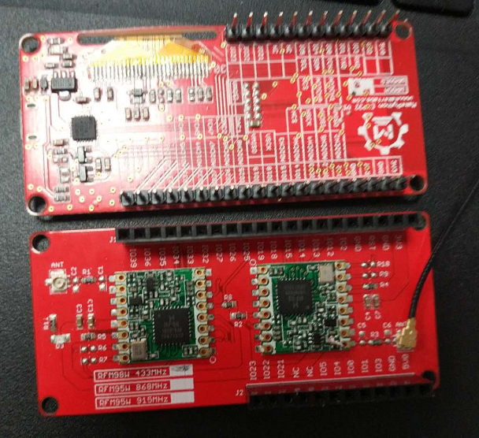
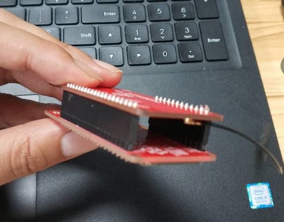
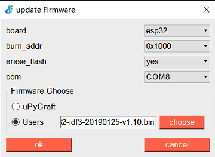
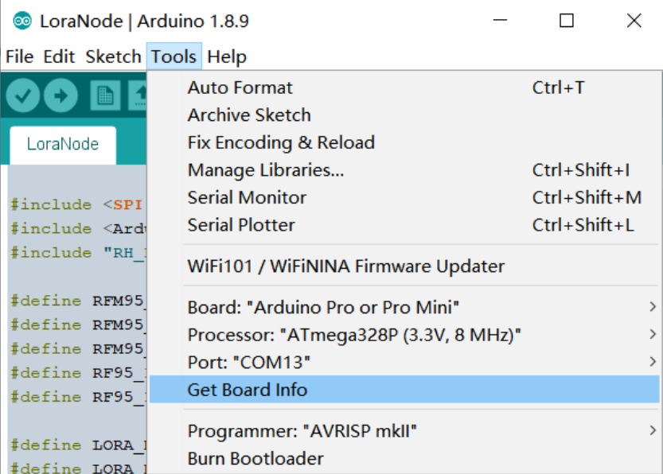

# Lora IoT Irrigation System

```c++
/*
Version:		V1.0
Author:			Vincent
Create Date:	2020/7/15
Note:
*/
```


[toc]

# OVERVIEW

## Intruduce

[Makerfabs home page](https://www.makerfabs.com/)

[Makerfabs Wiki](https://makerfabs.com/wiki/index.php?title=Main_Page)

Using ESP32 as a gateway, three soil sensors and a relay were controlled to form a simple Iot agriculture greenhouse simulation project.Ambient weather data, soil moisture data and relay status can be accessed via LCD screen and web page.And through a simple web page or code to control the timing of the relay switch and read data.



## Equipment list

- [MakePython ESP32](https://www.makerfabs.com/wiki/index.php?title=MakePython_ESP32)
- [MakaPython Lora](https://www.makerfabs.com/wiki/index.php?title=MakaPython_Lora)
-  [Lora Relay](https://www.makerfabs.com/wiki/index.php?title=Lora_Relay)
-  soil
-  CP2104 USB2UART Module

# DOWNLOAD CODE

## MicroPython Lora
- Plug the ESP32 and Lora extension boards together.






- Connect MakePython ESP32 to your PC, open uPyCraft, and select connect to the serial port.

- Firmware will be prompted if it has not been burned before or for other reasons.Board selects ESP32, BURN_addr selects 0x1000, Erase_Flash selects Yes, com selects the port number.Firmware Choose Users, click Choose to Choose ESP32-IDF3-20190125-v1.10.bin in the folder.



- Download all python programs ending in.py from the "/Project_LOT-Irrigation-System/LoraLOT/workSpace to ESP32".


- Press the RST button on ESP32 to reset the development board.The LCD screen will display some default data.


## Burn Sensor
- Open arduino ide.
- Open file "/Project_LOT-Irrigation-System/LoraTransmitterADCAHT10/LoraTransmitterADCAHT10.ino"
- Select Tools/Manage Libraries.
- Install RadioLib by Jan Gromes.


- If youer ardino ide version is old,maybe can't auto install dependent libraries. You may manual install or upgrade arduino ide, such as 1.8.13.
- Change NODECODE to either soil0, soil1, or soil2.

```c++
#define NODENAME "soil3"
```

- After saving, select "Tools", select "Development Board" Arduino Pro or Pro min, select processor ATmega328p 3.3V 8MHz, and select corresponding serial port.



- Connect the sensor and PC through "CP2104 USB2UART Module"。


- Push Upload.


## Burn Relay

- Open file "/Project_LOT-Irrigation-System/Lora_relay_new/Lora_relay_new.ino"
- Connect relay and PC through "CP2104 USB2UART Module"。


- Choice relay port.
- Push Upload.

# CONTROL

## Web Control

- Restart ESP32 and wait for the LCD screen to refresh and show the latest round of sensor data.

- Enter the IP shown in the first row of the ESP32 LED screen in the browser address bar.


- 网页将显示一张表格和四个按钮

![web_page]

- 表格部分是ESP32内部保存的历史数据，分别为时间，继电器状态，传感器状态。

![data_sheet]

- Four buttons: Relay on, Water, Relay off, fresh.
	- Relay on : Turn on relay.
	- Water: Relay on for ten seconds.
	- Relay off : Turn off relay.
	- Fresh: Get the latest data.

- All but the Fresh button can trigger the sensor sampling.Fresh will only be used for the latest ESP32 data and will not affect the system's own passive measurement cycle.

- Once the system is determined to be in order, the sensors can be plugged into different locations for data sampling.


## Outdoor Test

- Place in the parking lot flower bed at four downstairs.


- Put it on the lawn about a hundred meters away.


## The data analysis


